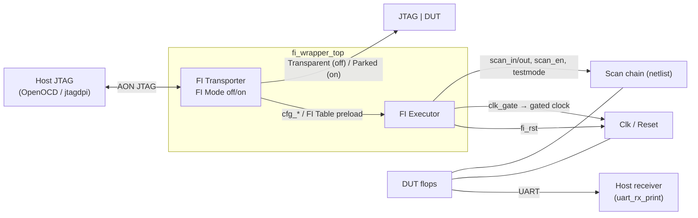
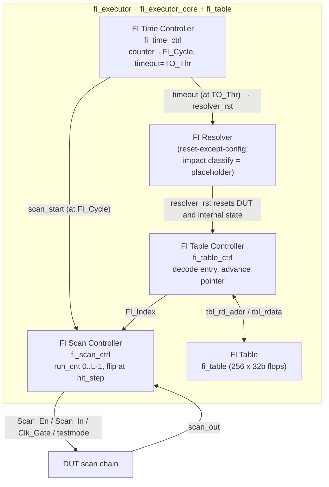
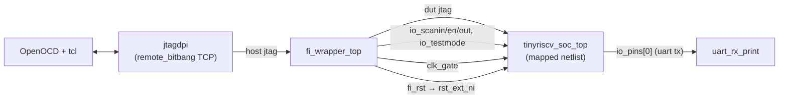

# Design — a sustained fault-injection wrapper

> What this is: a complete description of how the wrapper works, written so that a
> simulation can be reproduced, a bug can be debugged, an FPGA port can be
> attempted, and someone who did not build it can port it to their own DUT.
>
> Every claim here was checked against the code; file links are given throughout.

---

## 0. In one paragraph

The DUT (a tinyriscv RV32IM SoC) is synthesised **without flattening** and with
**scan insertion**, producing a netlist with a scan chain. A set of FI modules then
gives that netlist a sustained injection loop: **read one entry from the FI Table →
inject automatically (multi-bit possible) → reset automatically → read the next
entry**, until the table runs out. Blocks that are not on the chain are **frozen by
clock gating** for the duration of the injection; the UART survives that freeze
because of a **FIFO + CDC** in front of its serialiser. The host preloads the FI
Table and the configuration over JTAG/DMI, then the executor runs on its own.

---

## 1. Overview

### 1.1 System level



- **FI Mode off ⇒ Transparent.** Host JTAG passes straight through to the DUT's own
  JTAG; you debug the DUT normally.
- **FI Mode on ⇒ Parked.** The DUT's JTAG is parked, the Transporter takes over the
  host-facing TAP, and the Executor owns the DUT.
- **Impact classification** is currently done by external observation (UART, tb
  counters); see §5.6.

### 1.2 Inside the Executor



Block-to-code mapping. **The block names are the paper's** (Fig. 4 and Fig. 5);
the module and signal names follow them, so the paper can be read side by side
with the RTL. The one place where they diverge is the `FI_Entry` encoding: the
paper still draws a `Pattern_Len` count field, and the hardware uses a 1-bit EOP
marker instead — see the header of
[fi_table_ctrl.v](../rtl/fi/fi_table_ctrl.v).


| block | code | key signals |
|---|---|---|
| Host JTAG | tb `jtagdpi` + OpenOCD | `sim_jtag_tck/tms/tdi/tdo` |
| FI Transporter | [fi_transporter.v](../rtl/fi/fi_transporter.v) | `fi_mode_active`, `cfg_*`, `tbl_host_*` |
| JTAG \| DUT | DUT `jtag_TCK/TMS/TDI/TDO_pin` | `dut_jtag_*` |
| FI Executor | [fi_executor.v](../rtl/fi/fi_executor.v) | — |
| FI Time Controller | [fi_time_ctrl.v](../rtl/fi/fi_time_ctrl.v) | `clock_counter`, `fi_cycle_q`, `scan_start`, `resolver_rst` |
| FI Scan Controller | [fi_scan_ctrl.v](../rtl/fi/fi_scan_ctrl.v) | `run_cnt`, `hit_step_q/nx`, `entry_pop`, `scan_en_o`/`scan_in_o`/`clk_gate`, `done_o` |
| FI Table Controller | [fi_table_ctrl.v](../rtl/fi/fi_table_ctrl.v) | `word_ptr`, `la_index/la_vld` (lookahead), `eop_fetched`, `cycle_offset_q`, `table_exhausted` |
| FI Resolver | the reset sequence inside fi_time_ctrl | `resolver_rst`, `testmode_rst` |
| FI Table | [fi_table.v](../rtl/fi/fi_table.v) | `mem[]`, host port / exec port |
| Scan chain | inserted at synthesis | `io_scanin / io_scanen / io_scanout` |
| Clk / Reset | [fi_clk_gate.v](../syn/fi_clk_gate.v) + `fi_rst` | `fi_clk_gated`, `clk_gate`, `fi_rst` |
| Host receiver | [uart_rx_print.v](../tb/uart_rx_print.v) | `uart_rxd = io_pins[0]` |

---

## 2. Offline flow: RTL → synthesis (not flattened) → scan insertion → netlist

Driven by [syn/scanchain.tcl](../syn/scanchain.tcl) under Design Compiler:

1. **Synthesise without flattening**:
   `compile_ultra -scan -no_seq_output_inversion -no_autoungroup`.
   `-no_autoungroup` preserves the hierarchy; `-scan` maps flops into a
   scan-replaceable form.
2. **Insert the freeze gate and exclude the frozen blocks from the chain**
   (`fi_insert_clock_gate` / `fi_apply_scan_exclusion`, §6.1). Which blocks those
   are is declared once in [syn/fi_scan_cfg.tcl](../syn/fi_scan_cfg.tcl).
3. **Declare the DFT signals** (`set_dft_signal`): ScanClock = the functional clock,
   Reset = the async reset, TestMode = `io_testmode`; `create_port io_scanin /
   io_scanen / io_scanout` bound to ScanDataIn / ScanEnable / ScanDataOut.
4. `create_test_protocol` → `insert_dft` → `report_scan_path` gives the chain length
   and order.
5. **Assert the five invariants** (`fi_check_invariants`) and **export the map**
   (`fi_export_scanmap`).

**Top-level scan contract** — the DUT's netlist must expose:
`clk_50m_i, rst_ext_ni, io_testmode, scan_gate, io_scanin, io_scanen, io_scanout`
(the freeze input is named by `FI_GATE_PORT`; FIawase calls the signal `Clk_Gate`)
alongside its functional ports.

**Why flattening must be off.** Keeping the hierarchy means (a) scan cell order is
stable and a scan index can be tied to a named flop, and (b) the testbench and the
waveform viewer can reach internal state by name, e.g.
`u_tinyriscv_soc_top.u_rom.u_gen_ram.ram` or
`u_tinyriscv_core.u_ifu_idu.inst_valid_o`.

---

## 3. Simulation integration

Top level: [chaos_soc_tb.sv](../tb/chaos_soc_tb.sv).



- **The DUT is the synthesised netlist**, not the RTL. The netlist is not
  distributed with this repository; you produce it from your own synthesis run.
- **Clocks**: `aon_hfclk_i = clk_i` (50 MHz, `always #10`); for `aon_lfclk_i` see §7.
- **Reset**: `fi_rst = aon_rst_ni & ~resolver_rst_w`
  ([fi_wrapper_top.v](../rtl/fi/fi_wrapper_top.v)), wired to the DUT's `rst_ext_ni`.
- **Firmware**: `$readmemh` into ROM; the path comes from `+firmware=<file>`.
- **Host JTAG**: `jtagdpi` runs a remote_bitbang TCP server that OpenOCD connects to.

---

## 4. FI Transporter — JTAG ownership and DMI configuration

File: [fi_transporter.v](../rtl/fi/fi_transporter.v). Structure:

```
TAP (fi_jtag_tap) → DTM (fi_jtag_dtm_v6)
                     → 2-phase CDC (fi_cdc_2phase_v6, tck ↔ aon)
                     → DMI registers (fi_dmi_regs_v6)
```

### 4.1 Two modes

| mode | `fi_mode_active` | DUT JTAG | host TDO comes from | used for |
|---|---|---|---|---|
| **Transparent** | 0 | passed through (`dut_jtag_* = jtag_*`) | the DUT's TDO | debugging the DUT normally |
| **Parked** | 1 | cut off (`tck=0`, `tms=1`, `tdi=0`) | the Transporter's own TAP | the Executor owns the DUT, FI runs |

While passive the DTM only **snoops** for one trigger: a DMI write to `FI_MODE` with
`data[0]=1` switches to Parked at a safe TAP boundary (RTI/TLR with the DTM idle).
Once parked, the host is talking to the Transporter's TAP (IDCODE `0xF17E_0006`) and
can read and write the private FI registers.

### 4.2 Private FI DMI registers (base `0x60`)

| address | name | R/W | meaning |
|---|---|---|---|
| `0x60` | FI_MODE | RW | bit0: 1 = Parked/FI, 0 = Transparent |
| `0x61` | FI_STATUS | R | bit0 `cfg_en_able` (auto loop running); bit1 table finished; bit2 entries out of order; bit3 table ended without EOP; bit4 FI_Cycle walked past the timeout |
| `0x62` | CFG0 | RW | bit0 = AUTO, bit1 = END |
| `0x63` | CFG_SCAN_LEN | RW | **scan chain length L**. A runtime value; unrelated to the table encoding |
| `0x64` | CFG_FI_INDEX | RW | static injection index (used when not in auto mode) |
| `0x65` | CFG_FI_CYCLE | RW | **base** cycle at which to inject. Writing it reloads the running register `fi_cycle_q` (`counter == fi_cycle_q` → inject) |
| `0x66` | CFG_TO_THR | RW | timeout / reset cycle (`counter >= this` → reset) |
| `0x67` | FI_CMD | W | bit0 = start pulse (not needed in auto mode) |
| `0x68` | **CFG_TBL_LEN** | RW | number of FI_Entry words in this batch. **Resets to 0, which injects nothing** — fail-safe |
| `0x69` | **FI_CYCLE** | R | the live `fi_cycle_q`, advanced by `Cycle_Offset` each trial |
| `0x6F` | **FI_VERSION** | R | table format. `0x0002_0000` = EOP/Cycle_Offset, `0x0001_0000` = the older `{N,FI_Index}` |
| `0x70` | TBL_CTRL | RW | bit0 = AUTOINC (pointer advances after each WDATA write) |
| `0x71` | TBL_ADDR | RW | table write pointer |
| `0x72` | TBL_WDATA | W | write one word (implicit write strobe) |
| `0x73` | TBL_RCMD | W | issue a read |
| `0x74` | TBL_RDATA | R | read data; the low 2 bits are the response (valid = OK, not ready = BUSY) |
| `0x75` | TBL_STATUS | R | bit0 autoinc, bit1 pending, bit2 valid |

### 4.3 Host configuration sequence

See [host/inject_and_run_dmi.tcl](../host/inject_and_run_dmi.tcl):

1. `FI_MODE = 1` (`0x60 ← 1`) — switch to Parked.
2. Load the table: `TBL_CTRL.AUTOINC = 1` (`0x70 ← 1`), `TBL_ADDR = 0` (`0x71 ← 0`),
   then write each word to `TBL_WDATA` (`0x72`). The helper
   `fi_pattern <offset> {<FI_Index list>}` emits all the entries of one pattern and
   **sorts them into descending `FI_Index` for you**.
3. Configure: `CFG0 = AUTO` (`0x62`), `CFG_SCAN_LEN` (`0x63`), `CFG_FI_INDEX = 0` (`0x64`),
   **`CFG_TBL_LEN = <entry count>` (`0x68`)**, `CFG_FI_CYCLE` (`0x65`),
   `CFG_TO_THR` (`0x66`).
4. Auto mode needs **no explicit start** — the Time Controller triggers itself.

**The write order is not free.** `CFG_TO_THR` must be written **last**, because it is
what arms the loop; `CFG_TBL_LEN` and `CFG_FI_CYCLE` must be in before it. Forgetting
`0x68` means **nothing is injected at all** — deliberately a visible failure rather
than a wrong one.

The low-level DMI write is `fi_dmi_write` in [host/tapename.tcl](../host/tapename.tcl):
`irscan 0x11` (the DMI IR) followed by
`drscan {op=WRITE(2'b10), data[31:0], addr[6:0]}`.

---

## 5. FI Executor — the autonomous loop

[fi_executor.v](../rtl/fi/fi_executor.v) = `fi_executor_core` (three sub-controllers)
+ `fi_table` (the table). The glue is
[fi_executor_core.v](../rtl/fi/fi_executor_core.v).

### 5.1 FI Time Controller ([fi_time_ctrl.v](../rtl/fi/fi_time_ctrl.v))

- `clock_counter` free-runs, +1 per cycle while not stopped.
- `counter == fi_cycle_q` raises `scan_start` ("inject at FI_Cycle") and sets the
  one-shot latch `fi_fired_q`, so there is at most one injection per trial.
- **`fi_cycle_q` is a running register, not a constant.** The host's write to `0x65`
  is a write strobe that loads the base value; at the end of phase 2 of every reset
  window it is incremented by the current pattern's `Cycle_Offset`, **atomically with
  `clock_counter <= 0`**. It must not be incremented at `done` — that would let the
  `==` comparison fire a second time inside the same trial. It naturally sits outside
  the FI Resolver's reset: the Time Controller *produces* `resolver_rst` and never
  consumes it.
- `counter >= cfg_to_thr` (or a rising edge on `cfg_end`) raises `stop_event`, which
  enters the reset window (§7).
- The reset window first asserts `testmode_rst` (pulling top-level testmode low
  immediately), then raises `resolver_rst` **aligned to an `aon_rtcToggle_a` edge** — up
  on one edge, released on the next. On release the counter is cleared and free
  running resumes.
- `fi_cycle_q >= cfg_to_thr` raises `fi_cycle_ovf`: the sweep has walked past the end
  of the program window, so the batch stops itself rather than burning a full timeout
  per remaining trial.

### 5.2 FI Scan Controller ([fi_scan_ctrl.v](../rtl/fi/fi_scan_ctrl.v))

- On start (from `scan_start` or `cfg_start`): `testmode` leads by one cycle,
  `scan_en` goes high, `run_cnt` walks 0 → `L-1` where `L = cfg_scan_len`.
  **One pattern is always exactly one pass of L cycles**; there are no extra rounds.
- Datapath: `scan_in = (run_cnt == hit_step_q) ? ~scan_out : scan_out`, pass-through
  otherwise.
- `hit_step = (FI_Index == 0 || FI_Index > L) ? L : (L - 1 - FI_Index)`. `FI_Index` is **tail-relative**;
  `L` means "no flip".
- **Several flips in one pass.** The index is not one register but a **two-stage front
  end**, `hit_step_q` / `hit_step_nx`. On a hit, `q ← nx`, `nx ←` the Table
  Controller's new head, and the entry is popped in the same cycle, so the next
  target is armed on the **very next cycle**. The **minimum spacing between two
  targets is 1**, which is exactly the adjacent-cell case a multi-bit upset model
  most wants. `|F|` bits are flipped in one pass, so the DUT is frozen for `L`
  cycles rather than `N × L`.
- An out-of-order entry (`run_cnt > hit_step_q`) is dropped and sets `err_order`;
  a null entry (`hit_step > L-1`) retires immediately so it cannot block the targets
  behind it.
- At the end of the pass a `done` pulse is emitted, `scan_en` and `clk_gate` drop,
  and `testmode` trails by `TM_TAIL_CYCLES`.

### 5.3 FI Table Controller ([fi_table_ctrl.v](../rtl/fi/fi_table_ctrl.v))

- There is exactly one pointer, `word_ptr` (a word count); the byte address is
  derived combinationally, so there is no `[7:2]` wrap-around problem.
- **Fixed-depth lookahead**: a `LOOKAHEAD = 4` shift register whose head is a plain
  register, so the consumer-side comparator timing is unchanged.
- **The fill window is `[falling edge of resolver_rst, EOP entry fetched or
  word_ptr == Table_Len]`**, greedily refilling one word per cycle. The exec port is
  a purely combinational read, so advancing the pointer *is* the whole memory access
  and the data is available the next cycle. Trials are tens of thousands of cycles
  apart, so by the time a trigger arrives the pattern is long since staged and
  **arming is a plain register load with zero fetch latency**. When
  `|F| > LOOKAHEAD` it refills while consuming, at the same one-entry-per-cycle rate.
- Fetching an entry with `EOP = 1` latches `cycle_offset_q` and stops the fill, leaving
  the pointer exactly on the first entry of the next pattern.
- **The end of the table is counted, not sentinelled** (`word_ptr` vs `Table_Len`) —
  `0x0000_0000` is now a legal entry. `table_exhausted` is set only on the `done` of
  the last pattern; it cannot be set earlier, because the index stream is consumed
  throughout the whole pass.
- The `resolver_rst` soft reset **preserves four things**: `word_ptr`, `cycle_offset_q`,
  `table_exhausted`, `err_malformed`.

### 5.4 FI Table ([fi_table.v](../rtl/fi/fi_table.v))

- **256 words × 32 bits of flops** — no SRAM macro, so the table needs no library.
- A host port (written by the Transporter, whole words) plus a combinational exec
  read port (`exec_rdata = mem[exec_rd_addr[.. :2]]`, byte address / 4).
- **Reset clears the memory to 0.** Note that under the current encoding all-zero is
  a *legal* entry (EOP=0, offset=0, FI_Index=0); the end of the table comes from
  `CFG_TBL_LEN`, not from a sentinel.

### 5.5 FI Table encoding (EOP + Cycle_Offset)

```
W_IDX = $clog2(N_FF); N_FF comes from fi_scan_cfg.vh
(= 8192 ⇒ W_IDX = 13, so Cycle_Offset is 18 bits)

bit  31 30                W_IDX W_IDX-1      0
    +---+--------------------+--------------+
    |EOP|    Cycle_Offset    |   FI_Index   |
    +---+--------------------+--------------+
```

> The paper's Fig. 6 still shows the older three-field layout
> `{Cycle_Offset(4b), Pattern_Len(12b), FI_Index(16b)}`. The hardware uses the
> layout above: a 1-bit end-of-pattern marker in place of a `Pattern_Len` count.

| field | valid when | meaning |
|---|---|---|
| `EOP` | always | 1 = this is the last entry of the current replay pattern |
| `Cycle_Offset` | **only when EOP=1** | non-negative increment added to `FI_Cycle` after this pattern's trial. Patterns that stay on the same cycle write 0 |
| `FI_Index` | always | tail-relative position (`hit_step = L-1-FI_Index`; `FI_Index == 0` means no flip) |

- **One pattern = one pass of L cycles.** All of its entries are consumed inside that
  single pass, so an `|F|`-bit MBU freezes the DUT for `L` cycles, not `|F| × L`.
- **Within a pattern `FI_Index` must descend** (i.e. `hit_step` ascends); a spacing of 1 is
  legal. The host's `fi_pattern` sorts for you.
- **`N_FF` is an encoding bound, not the current chain length.** It is a power of two
  on purpose, so that the field boundaries do not move when `L` drifts across
  re-synthesis. The runtime chain length is still `CFG_SCAN_LEN`. The contract is
  **L ≤ 2^W_IDX − 1**, asserted at synthesis (A4).
- End of table: `word_ptr == CFG_TBL_LEN`. If the last entry has `EOP = 0` the table
  is malformed; the hardware closes the pattern with an implicit EOP and sets
  `err_malformed`.

Worked example — a table with six patterns in nine entries (`CFG_TBL_LEN = 9`), all
offsets zero, for a chain of length 4143:

| word | hex | EOP | offset | FI_Index | pattern |
|---|---|---|---|---|---|
| 0 | `0x80000244` | 1 | 0 | 580 | P0, single bit |
| 1 | `0x00000270` | 0 | — | 624 | P1, 3-bit MBU, **FI_Index descending** |
| 2 | `0x00000269` | 0 | — | 617 | P1 |
| 3 | `0x80000268` | 1 | 0 | 616 | P1, last |
| 4 | `0x80000294` | 1 | 0 | 660 | P2 |
| 5 | `0x800002D2` | 1 | 0 | 722 | P3 |
| 6 | `0x000006C0` | 0 | — | 1728 | P4, 2-bit MBU |
| 7 | `0x800006BA` | 1 | 0 | 1722 | P4, last |
| 8 | `0x80000521` | 1 | 0 | 1313 | P5 |

### 5.6 FI Resolver and the auto loop

- **The Resolver is "reset except config".** `resolver_rst` resets the DUT (via `fi_rst`)
  and the executor's internal state, but **preserves the FI configuration and the
  table pointer**.
- **Impact classification is a design placeholder and is not implemented in RTL.**
  Impact is observed externally: the UART (`uart_rx_print`), the tb's `inst_valid`
  counters, and `sim_end`.
- **Auto-loop enable** ([fi_executor_core.v](../rtl/fi/fi_executor_core.v)): with
  `cfg_auto = 1`, `cfg_en_able` is set on every rising edge of `resolver_rst` and cleared
  by `table_exhausted` or `fi_cycle_ovf`. **The clear ranks above the set** — without
  that, the loop would restart itself for one cycle after every reset even once the
  table was finished.
- **Two possible target sources.** In auto mode the entry stream comes from the Table
  Controller; otherwise a single synthetic entry is built from `cfg_fi_index`, which
  keeps the manual single-flip path alive. Once the table is done, `cfg_en_able = 0`
  and the script's `cfg_fi_index = 0` give `arm_ok = 0`, so no further scan pass starts.

### 5.7 One FI iteration (auto mode)

```mermaid
sequenceDiagram
  participant T as Time Ctrl
  participant S as Scan Ctrl
  participant B as Table Ctrl
  participant D as DUT
  Note over D: reset released, program runs from the start
  Note over B: resolver_rst falls → prefill lookahead, stop at EOP, latch Cycle_Offset
  T->>T: counter++ until == fi_cycle_q
  T->>S: scan_start (and set the fi_fired latch)
  S->>B: pop entries one by one
  S->>D: clk_gate=1 (freeze off-chain blocks) + one pass of L cycles,<br/>flipping once at each of the |F| hit_step values
  Note over D: |F|-bit pattern injected, clk_gate=0, DUT keeps running
  T->>T: counter continues to >= CLK_TO
  T->>D: resolver_rst → fi_rst resets the DUT
  Note over B: internal state cleared, word_ptr / cycle_offset kept → next pattern
  Note over T,D: counter cleared and fi_cycle_q += Cycle_Offset in the same cycle;<br/>loop stops after the done of the pass where word_ptr == TBL_LEN
```

---

## 6. Clock gating and the UART FIFO (the DUT-side requirements)

### 6.1 Freezing the off-chain blocks — inserted by the synthesis script, no RTL change

**There is no clock gating in the DUT's RTL.** What gets frozen is declared once, in
[syn/fi_scan_cfg.tcl](../syn/fi_scan_cfg.tcl):

```tcl
set FI_GATE_PINS { u_rom/clk_i u_ram/clk_i u_jtag/clk_i uart0/clk_i
                   spi0/clk_i xip/clk_i bootrom/clk_i u_pinmux/clk_i }
set FI_EXEMPT        { u_rst uart0 }
set FI_EXEMPT_CLOCKS { jtag_TCK }
```

Before `compile_ultra`, [fi_scan_lib.tcl](../syn/fi_scan_lib.tcl) compiles
[fi_clk_gate.v](../syn/fi_clk_gate.v) into the netlist, re-routes those pins onto
`fi_clk_gated`, and applies `set_scan_element false` to their owning instances.
After `insert_dft` it checks five invariants, of which A2 — **no flop is both on the
chain and frozen** — is the one everything rests on.

```
gate_q  = FF(clk_gate)                 // exactly one stage
freeze  = gate_q & clk_gate            // engage late, release early
clk_o   = clk & latch_neg(~freeze)      // latch + AND, full-width pulses
```

**Why the enable is the asymmetric `gate_q & clk_gate` and not just `~gate_q`.**
The window contract (`fi_scan_ctrl.v:14-20`) is: *the chain takes L extra shift
edges, so the off-chain blocks must lose exactly L functional edges*. An ICG decides
per edge based on the enable during the preceding low phase, so:

- enable from the registered `gate_q` alone masks **L+1** cycles (one too many);
- enable from the raw `clk_gate` alone also masks **L+1** (starting one cycle early).

Only the AND of the two — **engage on the registered version** (so the edge at S+1
still passes) and **release on the raw version** (so the edge at S+L+2 passes) — is
exactly L. That is not a trick; it is the intersection of the two windows.

**Measured** ([tests/run.sh](../tests/run.sh): the real `fi_scan_ctrl`, both real
gate modules, real rotate-and-restore passes):

| gate | cycles masked | short pulses |
|---|---|---|
| `clk & ~gate_q` (the original combinational form) | **L** ✅ | 1 (a runt at the start of the window, width = t_co) |
| ICG with `E = ~gate_q` | **L+1** ❌ | 0 |
| ICG with `E = ~(gate_q & clk_gate)` (**used**) | **L** ✅ | **0** |

For `L ∈ {1,2,3,5,8,17,64,257,4143}` over one or two passes, the two gates mask the
**same set of cycles with zero disagreement** and the chain is restored bit-perfect
every time. So the new gate is **cycle-for-cycle equivalent** to the combinational
form it replaces; it only turns that form's runt and late pulses at the two window
boundaries into full-width ones. Re-run the regression after touching
`fi_clk_gate.v` or `fi_scan_ctrl.v`.

Three things that must not change:

- **Exactly one synchroniser flop.** Adding a second stage "for metastability" shifts
  the whole window by a cycle and silently breaks restoration.
- **`clk_gate` must be in the same clock domain as `clk`.** The enable reads the raw
  `clk_gate` combinationally, and the whole L-cycle account only means anything
  inside one domain. Across a genuine domain crossing the account does not hold at
  all and a synchroniser will not save it.
- **Never declare `fi_clk_gated` as a ScanClock.**

**The porting contract is one line**: the DUT's top level exposes one freeze
input. Everything else lives in that tcl file.

### 6.2 The UART survives the freeze via a FIFO and a CDC

[scan_uart_core.sv](../rtl/soc/perips/uart/scan_uart_core.sv) (top level
`scan_uart_top`, instantiated with `clk_i` gated and `clk_tx_i` ungated):

- **Two clocks.** The register file and the TX FIFO run on the gated `clk_i`; the
  serialiser runs on the ungated `clk_tx_i`. Between them sit a depth-8 TX FIFO and a
  1-deep CDC bridge (`cdc_rv_1deep`).
- `scan_gate` is synchronised onto the ungated `clk_tx_i` as `scan_gate_view`; during
  injection `tx_valid_a` / `tx_we_b` are deasserted, so the FIFO does not pop and no
  new byte is started.
- A byte already in flight **finishes transmitting**, because the transmit-side clock
  is not gated. Once the gate reopens, transmission resumes cleanly.
- ⇒ clock gating neither interrupts nor corrupts the UART output.

---

## 7. Pacing the reset window

The reset window between trials advances on `rst_advance` in
[fi_time_ctrl.v](../rtl/fi/fi_time_ctrl.v), and there are two ways to generate it,
selected by the `RTC_ALIGN_EN` parameter:

```verilog
wire rst_advance = (RTC_ALIGN_EN != 0) ? rtc_rise_pulse : rst_cnt_hit;
```

| | `RTC_ALIGN_EN = 0` (**the default**) | `RTC_ALIGN_EN = 1` |
|---|---|---|
| paced by | a fixed count of `RST_CYC` functional cycles (default 32) | rising edges of `aon_rtcToggle_a` (= `aon_lfclk_i`) |
| `aon_lfclk_i` | unused; tie it off | **must actually toggle** |
| for | single-clock DUTs | a DUT with a genuine independent slow clock |

**The shipped configuration is `RTC_ALIGN_EN = 0, RST_CYC = 32`**, set as the default
in `fi_wrapper_top`, `fi_executor_core` and `fi_time_ctrl`, and not overridden by the
testbench. Under it the auto-reset loop runs, and the testbench's
`.aon_lfclk_i (1'b0)` tie-off is correct rather than a bug.

**Why the RTC alignment exists at all**: pinning `resolver_rst` to a slow-clock edge
makes the phase between "reset release" and the fast clock identical on every trial.
On a DUT with a real slow domain, if that phase jitters then the same `CFG_FI_CYCLE`
count lands on a different PC each round and a multi-bit upset stops being
reproducible.

> **The trap**: setting `RTC_ALIGN_EN = 1` while `aon_lfclk_i` is tied to `1'b0`.
> `rtc_rise_pulse` never fires, the window sticks in `rtc_phase = 1`, `resolver_rst`
> is never raised, and the loop silently stops after the first trial.

---

## 8. The DUT-agnostic porting contract

To put this wrapper on a new DUT, the DUT side must provide:

| | requirement | provided here by |
|---|---|---|
| (a) scan insertable | after synthesis (**preferably not flattened**) the top exposes `io_scanin / io_scanen / io_scanout` — created by the flow — plus `io_testmode`, which **your DUT must already have**: it is declared with `-view existing_dft` and is not created for you | scanchain.tcl (first three only) |
| (a2) 5-bit JTAG IR | the wrapper's TAP and the DUT's share one IR shift under a single OpenOCD `-irlen`; with any other length the FI cutover silently never fires and every later write vanishes | `FI_JTAG_IR_BITS` in fi_transporter.v — no knob, edit the file |
| (b) off-chain blocks freezable | a top-level `clk_gate` input; the gate itself is inserted by the flow | fi_clk_gate.v + fi_scan_lib.tcl |
| (c) output peripherals keep streaming | transmit-type peripherals need a FIFO + CDC with an ungated transmit clock | scan_uart_core |
| (d) reset and gate wired in | top level takes the freeze input (`FI_GATE_PORT`) and `fi_rst` (active low) | fi_wrapper_top |
| (e) reset alignment | give `aon_rtcToggle_a` a slow toggle (§7) | not yet wired |

### Taking it to an FPGA

The FPGA path loads **the gate-level netlist directly**, not the RTL, because the
scan chain only exists in the netlist. So the standard-cell models have to come from
somewhere:

- **The vendor's cell library (`stdlib.v`) must be rewritten as synthesisable RTL.**
  PDK simulation models use `specify` blocks, UDP primitives and timing constructs
  that FPGA synthesis rejects. What you need is a plain behavioural equivalent of
  each cell the netlist actually instantiates -- the flops, the latch, and the
  combinational gates -- written so the FPGA tool infers its own LUTs and registers.
- Memory macros need the same treatment: replace each SRAM instance with a block-RAM
  wrapper carrying the same port list.
- **The freeze gate is the one place that differs structurally.** Latch-plus-AND is
  the wrong primitive on an FPGA. Use the vendor's clock-enable buffer (`BUFGCE` on
  Xilinx), or degrade the freeze to a clock *enable* on the affected flops and leave
  the clock tree alone. Either way the edge account must survive: the frozen blocks
  still have to lose exactly `L` edges (S6.1), and [tests/run.sh](../tests/run.sh) is
  how you prove whatever you substitute.

Parameters the wrapper side needs to know:

- **the scan chain length L** (= `CFG_SCAN_LEN`, written at **runtime**, taken from
  `report_scan_path`);
- **`N_FF`** ([fi_scan_cfg.vh](../rtl/fi/fi_scan_cfg.vh)), a **synthesis-time**
  constant. Only `$clog2` of it is used, and it fixes the FI_Entry field boundaries.
  The contract is **L ≤ N_FF − 1**. The host's `FI_W_IDX` must match; if it does not,
  **nothing errors — you simply inject into the wrong flop**. Both values are emitted
  by `fi_export_scanmap` for exactly this reason.
- `TBL_WORDS` (table depth, default 256), `LOOKAHEAD` (default 4), DMI address width (7).

---

## 9. Reproduce / debug checklist

### 9.1 Running a campaign

1. **Synthesise the netlist**: run [syn/scanchain.tcl](../syn/scanchain.tcl) in your
   DC flow; copy the resulting netlist plus the generated `fi_scan_cfg.vh` into the
   simulation tree, and the generated `fi_scan_cfg.tcl` values into
   [host/tapename.tcl](../host/tapename.tcl). **These move together** — a `CFG_SCAN_LEN`
   that does not match the netlist means the chain is never restored.
2. **Build the simulation** with the netlist, `rtl/fi/`, and `tb/`. Host JTAG goes
   through `jtagdpi` + `remote_bitbang` over TCP.
3. **Run**: start the simulator (which opens the remote_bitbang server), then
   point OpenOCD at [host/fi_openocd.cfg](../host/fi_openocd.cfg). That config
   sources [host/tapename.tcl](../host/tapename.tcl) and
   [host/inject_and_run_dmi.tcl](../host/inject_and_run_dmi.tcl) itself, after
   `init`, so a bare `telnet localhost 4444` already has the FI procs.
4. **Observe**: `uart_rx_print` prints the UART; the tb prints total cycles and
   IFU/IDU `inst_valid` counts; `sim_end = gpio_data_out[0]`.

### 9.2 Known hazards

- ⚠️ **lfclk wiring**: `aon_lfclk_i = 1'b0` stalls the auto-reset loop (§7).
- ⚠️ **`CFG_TBL_LEN` (0x68) must be written**, and before `CFG_TO_THR`. Forgetting it
  injects nothing (§5.5).
- ⚠️ **Within a pattern `FI_Index` must descend and the last entry must have `EOP = 1`.**
  Generating entries with `fi_pattern` makes this impossible to get wrong.
- **Impact classification is not implemented**; impact is observed externally (§5.6).
- **`CFG_SCAN_LEN` must equal the real chain length** of the netlist in the simulator.

---

## Appendix: file index

| category | files |
|---|---|
| Wrapper top | [fi_wrapper_top.v](../rtl/fi/fi_wrapper_top.v) |
| Transporter | [fi_transporter.v](../rtl/fi/fi_transporter.v) |
| Executor | [fi_executor.v](../rtl/fi/fi_executor.v) · [fi_executor_core.v](../rtl/fi/fi_executor_core.v) |
| Sub-controllers | [fi_time_ctrl.v](../rtl/fi/fi_time_ctrl.v) · [fi_scan_ctrl.v](../rtl/fi/fi_scan_ctrl.v) · [fi_table_ctrl.v](../rtl/fi/fi_table_ctrl.v) |
| Table | [fi_table.v](../rtl/fi/fi_table.v) · [fi_scan_cfg.vh](../rtl/fi/fi_scan_cfg.vh) |
| Freeze gate | [fi_clk_gate.v](../syn/fi_clk_gate.v) · [tests/tb_fi_clk_gate.v](../tests/tb_fi_clk_gate.v) |
| UART FIFO | [scan_uart_core.sv](../rtl/soc/perips/uart/scan_uart_core.sv) · [scan_uart_top.sv](../rtl/soc/perips/uart/scan_uart_top.sv) |
| Synthesis flow | [scanchain.tcl](../syn/scanchain.tcl) · [fi_scan_cfg.tcl](../syn/fi_scan_cfg.tcl) · [fi_scan_lib.tcl](../syn/fi_scan_lib.tcl) |
| Testbench | [chaos_soc_tb.sv](../tb/chaos_soc_tb.sv) · [uart_rx_print.v](../tb/uart_rx_print.v) |
| Host driver | [inject_and_run_dmi.tcl](../host/inject_and_run_dmi.tcl) · [tapename.tcl](../host/tapename.tcl) · [fi_openocd.cfg](../host/fi_openocd.cfg) |
