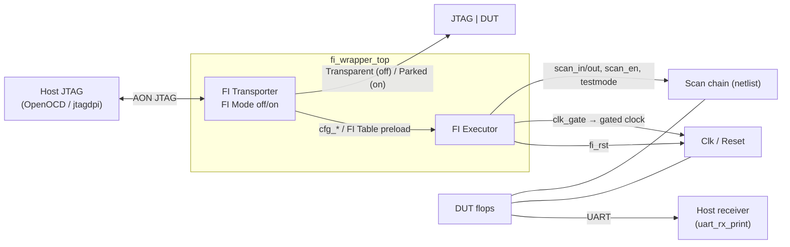
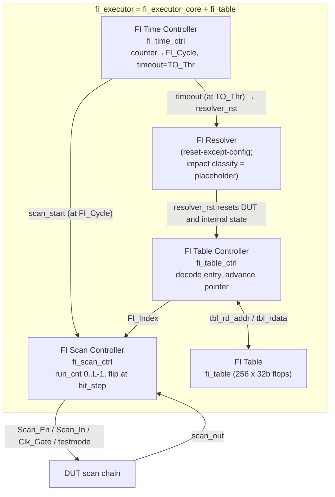
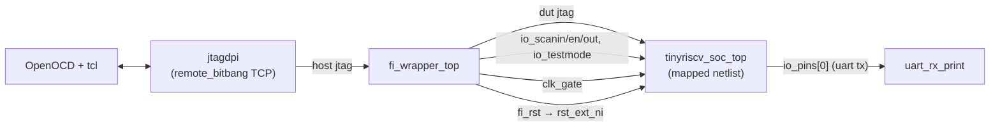

# Design

Architecture, register map, table encoding, and the DUT-side porting requirements.

---

## 0. Summary

The DUT (a tinyriscv RV32IM SoC) is synthesised without flattening and with scan
insertion. The FI modules drive that netlist in a loop: read one entry from the FI
Table, inject, reset, read the next entry, until the table runs out. Injection can be
multi-bit. Blocks not on the chain are frozen by clock gating during injection. The
UART keeps working through a FIFO and a CDC. The host preloads the FI Table and the
configuration over JTAG/DMI, then the executor runs on its own.

---

## 1. Overview

### 1.1 System level



- FI Mode off: Transparent. Host JTAG passes through to the DUT's JTAG.
- FI Mode on: Parked. The DUT's JTAG is parked and the Executor owns the DUT.
- Impact classification is done by external observation (§5.6).

### 1.2 Inside the Executor



| block | code | key signals |
|---|---|---|
| Host JTAG | tb `jtagdpi` + OpenOCD | `sim_jtag_tck/tms/tdi/tdo` |
| FI Transporter | [fi_transporter.v](../rtl/fi/fi_transporter.v) | `fi_mode_active`, `cfg_*`, `tbl_host_*` |
| JTAG \| DUT | DUT `jtag_TCK/TMS/TDI/TDO_pin` | `dut_jtag_*` |
| FI Executor | [fi_executor.v](../rtl/fi/fi_executor.v) | — |
| FI Time Controller | [fi_time_ctrl.v](../rtl/fi/fi_time_ctrl.v) | `clock_counter`, `fi_cycle_q`, `scan_start`, `resolver_rst` |
| FI Scan Controller | [fi_scan_ctrl.v](../rtl/fi/fi_scan_ctrl.v) | `run_cnt`, `hit_step_q/nx`, `entry_pop`, `scan_en_o`/`scan_in_o`/`clk_gate`, `done_o` |
| FI Table Controller | [fi_table_ctrl.v](../rtl/fi/fi_table_ctrl.v) | `word_ptr`, `la_index/la_vld` (lookahead), `eop_fetched`, `cycle_offset_q`, `table_exhausted` |
| FI Resolver | the reset sequence inside fi_time_ctrl | `resolver_rst`, `testmode_rst` |
| FI Table | [fi_table.v](../rtl/fi/fi_table.v) | `mem[]`, host port / exec port |
| Scan chain | inserted at synthesis | `io_scanin / io_scanen / io_scanout` |
| Clk / Reset | [fi_clk_gate.v](../syn/fi_clk_gate.v) + `fi_rst` | `fi_clk_gated`, `clk_gate`, `fi_rst` |
| Host receiver | [uart_rx_print.v](../tb/uart_rx_print.v) | `uart_rxd = io_pins[0]` |

---

## 2. Offline flow: RTL to netlist

Driven by [syn/scanchain.tcl](../syn/scanchain.tcl) under Design Compiler:

1. `compile_ultra -scan -no_seq_output_inversion -no_autoungroup`. `-no_autoungroup`
   preserves the hierarchy. `-scan` maps flops into a scan-replaceable form.
2. `fi_insert_clock_gate` / `fi_apply_scan_exclusion` insert the freeze gate and
   exclude the frozen blocks from the chain (§6.1). The block list is in
   [syn/fi_scan_cfg.tcl](../syn/fi_scan_cfg.tcl).
3. `set_dft_signal`: ScanClock = functional clock, Reset = async reset, TestMode =
   `io_testmode`. `create_port io_scanin / io_scanen / io_scanout`, bound to
   ScanDataIn / ScanEnable / ScanDataOut.
4. `create_test_protocol`, `insert_dft`, `report_scan_path`. The last gives the chain
   length and order.
5. `fi_check_invariants` (five invariants) and `fi_export_scanmap`.

Do not flatten. The hierarchy keeps scan cell order stable and lets the testbench
reach internal state by name.

Top-level scan contract. The netlist must expose, alongside its functional ports:
`clk_50m_i, rst_ext_ni, io_testmode, scan_gate, io_scanin, io_scanen, io_scanout`.
The freeze input is named by `FI_GATE_PORT`.

---

## 3. Simulation integration

Top level: [chaos_soc_tb.sv](../tb/chaos_soc_tb.sv).



- The DUT is the synthesised netlist, not the RTL. The netlist is not distributed here.
- Clocks: `aon_hfclk_i = clk_i` (50 MHz, `always #10`). For `aon_lfclk_i` see §7.
- Reset: `fi_rst = aon_rst_ni & ~resolver_rst_w`
  ([fi_wrapper_top.v](../rtl/fi/fi_wrapper_top.v)), wired to `rst_ext_ni`.
- Firmware: `$readmemh` into ROM. The path comes from `+firmware=<file>`.
- Host JTAG: `jtagdpi` runs a remote_bitbang TCP server for OpenOCD.

---

## 4. FI Transporter

File: [fi_transporter.v](../rtl/fi/fi_transporter.v).

```
TAP (fi_jtag_tap) → DTM (fi_jtag_dtm_v6)
                     → 2-phase CDC (fi_cdc_2phase_v6, tck ↔ aon)
                     → DMI registers (fi_dmi_regs_v6)
```

### 4.1 Two modes

| mode | `fi_mode_active` | DUT JTAG | host TDO comes from | used for |
|---|---|---|---|---|
| **Transparent** | 0 | passed through (`dut_jtag_* = jtag_*`) | the DUT's TDO | debugging the DUT normally |
| **Parked** | 1 | cut off (`tck=0`, `tms=1`, `tdi=0`) | the Transporter's own TAP | the Executor owns the DUT, FI runs |

A DMI write to `FI_MODE` with `data[0]=1` switches to Parked at a safe TAP boundary
(RTI/TLR with the DTM idle). Once parked, the host talks to the Transporter's TAP
(IDCODE `0xF17E_0006`) and can access the private FI registers.

### 4.2 Private FI DMI registers (base `0x60`)

| address | name | R/W | meaning |
|---|---|---|---|
| `0x60` | FI_MODE | RW | bit0: 1 = Parked/FI, 0 = Transparent |
| `0x61` | FI_STATUS | R | bit0 `cfg_en_able` (auto loop running); bit1 table finished; bit2 entries out of order; bit3 table ended without EOP; bit4 FI_Cycle walked past the timeout |
| `0x62` | CFG0 | RW | bit0 = AUTO, bit1 = END |
| `0x63` | CFG_SCAN_LEN | RW | scan chain length L. A runtime value, unrelated to the table encoding |
| `0x64` | CFG_FI_INDEX | RW | static injection index (used when not in auto mode) |
| `0x65` | CFG_FI_CYCLE | RW | base cycle at which to inject. Writing it reloads the running register `fi_cycle_q` (`counter == fi_cycle_q` → inject) |
| `0x66` | CFG_TO_THR | RW | timeout / reset cycle (`counter >= this` → reset) |
| `0x67` | FI_CMD | W | bit0 = start pulse (not needed in auto mode) |
| `0x68` | **CFG_TBL_LEN** | RW | number of FI_Entry words in this batch. Resets to 0, which injects nothing |
| `0x69` | **FI_CYCLE** | R | the live `fi_cycle_q`, advanced by `Cycle_Offset` each trial |
| `0x6F` | **FI_VERSION** | R | table format. `0x0002_0000` = EOP/Cycle_Offset, `0x0001_0000` = the older `{N,FI_Index}` |
| `0x70` | TBL_CTRL | RW | bit0 = AUTOINC (pointer advances after each WDATA write) |
| `0x71` | TBL_ADDR | RW | table write pointer |
| `0x72` | TBL_WDATA | W | write one word (implicit write strobe) |
| `0x73` | TBL_RCMD | W | issue a read |
| `0x74` | TBL_RDATA | R | read data; the low 2 bits are the response (valid = OK, not ready = BUSY) |
| `0x75` | TBL_STATUS | R | bit0 autoinc, bit1 pending, bit2 valid |

### 4.3 Host configuration sequence

See [host/inject_and_run_dmi.tcl](../host/inject_and_run_dmi.tcl):

1. `FI_MODE = 1` (`0x60 ← 1`).
2. Load the table: `TBL_CTRL.AUTOINC = 1` (`0x70 ← 1`), `TBL_ADDR = 0` (`0x71 ← 0`),
   then write each word to `TBL_WDATA` (`0x72`). The helper
   `fi_pattern <offset> {<FI_Index list>}` emits one pattern and sorts its entries into
   descending `FI_Index`.
3. Configure: `CFG0 = AUTO` (`0x62`), `CFG_SCAN_LEN` (`0x63`), `CFG_FI_INDEX = 0`
   (`0x64`), `CFG_TBL_LEN = <entry count>` (`0x68`), `CFG_FI_CYCLE` (`0x65`),
   `CFG_TO_THR` (`0x66`).
4. Auto mode needs no explicit start.

Write order: `CFG_TO_THR` last, because it arms the loop. `CFG_TBL_LEN` and
`CFG_FI_CYCLE` before it. If `0x68` is not written, nothing is injected.

The low-level DMI write is `fi_dmi_write` in [host/tapename.tcl](../host/tapename.tcl):
`irscan 0x11` (the DMI IR) then `drscan {op=WRITE(2'b10), data[31:0], addr[6:0]}`.

---

## 5. FI Executor

[fi_executor.v](../rtl/fi/fi_executor.v) = `fi_executor_core` (three sub-controllers)
plus `fi_table`. Glue: [fi_executor_core.v](../rtl/fi/fi_executor_core.v).

### 5.1 FI Time Controller ([fi_time_ctrl.v](../rtl/fi/fi_time_ctrl.v))

- `clock_counter` free-runs, +1 per cycle while not stopped.
- `counter == fi_cycle_q` raises `scan_start` and sets `fi_fired_q`. One injection per
  trial.
- `fi_cycle_q` loads its base value from `0x65`, then advances by `Cycle_Offset` at the
  end of each reset window, atomically with `clock_counter <= 0`.
- `counter >= cfg_to_thr`, or a rising edge on `cfg_end`, enters the reset window (§7).
- The reset window asserts `testmode_rst`, then `resolver_rst` for one
  `aon_rtcToggle_a` interval.
- `fi_cycle_q >= cfg_to_thr` raises `fi_cycle_ovf` and the batch stops.

### 5.2 FI Scan Controller ([fi_scan_ctrl.v](../rtl/fi/fi_scan_ctrl.v))

- On start (`scan_start` or `cfg_start`): `testmode` leads by one cycle, `scan_en` goes
  high, `run_cnt` walks 0 to `L-1` where `L = cfg_scan_len`.
- Datapath: `scan_in = (run_cnt == hit_step_q) ? ~scan_out : scan_out`.
- `hit_step = (FI_Index == 0 || FI_Index > L) ? L : (L - 1 - FI_Index)`. `FI_Index` is
  tail-relative. `L` means no flip.
- Several flips per pass. Minimum spacing between two targets is 1.
- An out-of-order entry (`run_cnt > hit_step_q`) is dropped and sets `err_order`. A
  null entry (`hit_step > L-1`) retires immediately.
- At the end of the pass `done` pulses, `scan_en` and `clk_gate` drop, and `testmode`
  trails by `TM_TAIL_CYCLES`.

### 5.3 FI Table Controller ([fi_table_ctrl.v](../rtl/fi/fi_table_ctrl.v))

- Fill window: `[falling edge of resolver_rst, EOP entry fetched or
  word_ptr == Table_Len]`, one word per cycle into a `LOOKAHEAD = 4` shift register.
  When `|F| > LOOKAHEAD` it refills while consuming, at the same rate.
- Fetching an entry with `EOP = 1` latches `cycle_offset_q` and stops the fill, leaving
  the pointer on the first entry of the next pattern.
- The end of the table is counted, not sentinelled (`word_ptr` vs `Table_Len`).
- `resolver_rst` preserves `word_ptr`, `cycle_offset_q`, `table_exhausted`,
  `err_malformed`.

### 5.4 FI Table ([fi_table.v](../rtl/fi/fi_table.v))

- 256 words x 32 bits of flops. No SRAM macro, so the table needs no library.
- A host port written by the Transporter, whole words. A combinational exec read port,
  `exec_rdata = mem[exec_rd_addr[.. :2]]`, byte address / 4.
- Reset clears the memory to 0. All-zero is a legal entry. The end of the table comes
  from `CFG_TBL_LEN`.

### 5.5 FI Table encoding (EOP + Cycle_Offset)

```
W_IDX = $clog2(N_FF); N_FF comes from fi_scan_cfg.vh
(= 8192 ⇒ W_IDX = 13, so Cycle_Offset is 18 bits)

bit  31 30                W_IDX W_IDX-1      0
    +---+--------------------+--------------+
    |EOP|    Cycle_Offset    |   FI_Index   |
    +---+--------------------+--------------+
```

| field | valid when | meaning |
|---|---|---|
| `EOP` | always | 1 = this is the last entry of the current replay pattern |
| `Cycle_Offset` | **only when EOP=1** | non-negative increment added to `FI_Cycle` after this pattern's trial. Patterns that stay on the same cycle write 0 |
| `FI_Index` | always | tail-relative position (`hit_step = L-1-FI_Index`; `FI_Index == 0` means no flip) |

- One pattern = one pass of L cycles. All of its entries are consumed inside that pass,
  so an `|F|`-bit MBU freezes the DUT for `L` cycles, not `|F| × L`.
- Within a pattern `FI_Index` must descend, so `hit_step` ascends. A spacing of 1 is
  legal. `fi_pattern` sorts for you.
- `N_FF` is an encoding bound, not the current chain length, and is a power of two. The
  contract is `L ≤ 2^W_IDX − 1`, asserted at synthesis (A4).
- End of table: `word_ptr == CFG_TBL_LEN`. If the last entry has `EOP = 0` the table is
  malformed. The hardware closes the pattern with an implicit EOP and sets
  `err_malformed`.

Example: six patterns in nine entries (`CFG_TBL_LEN = 9`), all offsets zero, chain
length 4143.

| word | hex | EOP | offset | FI_Index | pattern |
|---|---|---|---|---|---|
| 0 | `0x80000244` | 1 | 0 | 580 | P0, single bit |
| 1 | `0x00000270` | 0 | — | 624 | P1, 3-bit MBU, **FI_Index descending** |
| 2 | `0x00000269` | 0 | — | 617 | P1 |
| 3 | `0x80000268` | 1 | 0 | 616 | P1, last |
| 4 | `0x80000294` | 1 | 0 | 660 | P2 |
| 5 | `0x800002D2` | 1 | 0 | 722 | P3 |
| 6 | `0x000006C0` | 0 | — | 1728 | P4, 2-bit MBU |
| 7 | `0x800006BA` | 1 | 0 | 1722 | P4, last |
| 8 | `0x80000521` | 1 | 0 | 1313 | P5 |

### 5.6 FI Resolver and the auto loop

- `resolver_rst` resets the DUT (via `fi_rst`) and the executor's internal state. It
  preserves the FI configuration and the table pointer.
- Impact classification is not implemented in RTL. Impact is observed externally: the
  UART (`uart_rx_print`), the tb's `inst_valid` counters, and `sim_end`.
- Auto-loop enable ([fi_executor_core.v](../rtl/fi/fi_executor_core.v)): with
  `cfg_auto = 1`, `cfg_en_able` is set on every rising edge of `resolver_rst` and
  cleared by `table_exhausted` or `fi_cycle_ovf`. The clear ranks above the set.
- In auto mode the entry stream comes from the Table Controller. Otherwise a single
  synthetic entry is built from `cfg_fi_index`.

### 5.7 One FI iteration (auto mode)

```mermaid
sequenceDiagram
  participant T as Time Ctrl
  participant S as Scan Ctrl
  participant B as Table Ctrl
  participant D as DUT
  Note over D: reset released, program runs from the start
  Note over B: resolver_rst falls → prefill lookahead, stop at EOP, latch Cycle_Offset
  T->>T: counter++ until == fi_cycle_q
  T->>S: scan_start (and set the fi_fired latch)
  S->>B: pop entries one by one
  S->>D: clk_gate=1 (freeze off-chain blocks) + one pass of L cycles,<br/>flipping once at each of the |F| hit_step values
  Note over D: |F|-bit pattern injected, clk_gate=0, DUT keeps running
  T->>T: counter continues to >= CLK_TO
  T->>D: resolver_rst → fi_rst resets the DUT
  Note over B: internal state cleared, word_ptr / cycle_offset kept → next pattern
  Note over T,D: counter cleared and fi_cycle_q += Cycle_Offset in the same cycle;<br/>loop stops after the done of the pass where word_ptr == TBL_LEN
```

---

## 6. Clock gating and the UART FIFO

### 6.1 Freezing the off-chain blocks

There is no clock gating in the DUT's RTL. What gets frozen is declared in
[syn/fi_scan_cfg.tcl](../syn/fi_scan_cfg.tcl):

```tcl
set FI_GATE_PINS { u_rom/clk_i u_ram/clk_i u_jtag/clk_i uart0/clk_i
                   spi0/clk_i xip/clk_i bootrom/clk_i u_pinmux/clk_i }
set FI_EXEMPT        { u_rst uart0 }
set FI_EXEMPT_CLOCKS { jtag_TCK }
```

Before `compile_ultra`, [fi_scan_lib.tcl](../syn/fi_scan_lib.tcl) compiles
[fi_clk_gate.v](../syn/fi_clk_gate.v) into the netlist, re-routes those pins onto
`fi_clk_gated`, and applies `set_scan_element false` to their owning instances. After
`insert_dft` it checks five invariants. A2: no flop is both on the chain and frozen.

```
gate_q  = FF(clk_gate)                 // exactly one stage
freeze  = gate_q & clk_gate            // engage late, release early
clk_o   = clk & latch_neg(~freeze)      // latch + AND, full-width pulses
```

Window contract (`fi_scan_ctrl.v:14-20`): the chain takes L extra shift edges, so the
off-chain blocks must lose exactly L functional edges. Measured by
[tests/run.sh](../tests/run.sh) for `L ∈ {1,2,3,5,8,17,64,257,4143}`:

| gate | cycles masked | short pulses |
|---|---|---|
| `clk & ~gate_q` (the original combinational form) | **L** ✅ | 1 (a runt at the start of the window, width = t_co) |
| ICG with `E = ~gate_q` | **L+1** ❌ | 0 |
| ICG with `E = ~(gate_q & clk_gate)` (**used**) | **L** ✅ | **0** |

Re-run that regression after touching `fi_clk_gate.v` or `fi_scan_ctrl.v`. Three
things must not change:

- Exactly one synchroniser flop. A second stage shifts the window by a cycle and
  silently breaks restoration.
- `clk_gate` must be in the same clock domain as `clk`.
- Never declare `fi_clk_gated` as a ScanClock.

### 6.2 The UART survives the freeze

[scan_uart_core.sv](../rtl/soc/perips/uart/scan_uart_core.sv), top level
`scan_uart_top`, instantiated with `clk_i` gated and `clk_tx_i` ungated:

- The register file and the TX FIFO run on the gated `clk_i`. The serialiser runs on
  the ungated `clk_tx_i`. Between them sit a depth-8 TX FIFO and a 1-deep CDC bridge
  (`cdc_rv_1deep`).
- `scan_gate` is synchronised onto `clk_tx_i` as `scan_gate_view`. During injection
  `tx_valid_a` / `tx_we_b` are deasserted, so the FIFO does not pop.
- A byte already in flight finishes. Transmission resumes when the gate reopens.

---

## 7. Pacing the reset window

The reset window advances on `rst_advance` in
[fi_time_ctrl.v](../rtl/fi/fi_time_ctrl.v), selected by `RTC_ALIGN_EN`:

```verilog
wire rst_advance = (RTC_ALIGN_EN != 0) ? rtc_rise_pulse : rst_cnt_hit;
```

| | `RTC_ALIGN_EN = 0` (**the default**) | `RTC_ALIGN_EN = 1` |
|---|---|---|
| paced by | a fixed count of `RST_CYC` functional cycles (default 32) | rising edges of `aon_rtcToggle_a` (= `aon_lfclk_i`) |
| `aon_lfclk_i` | unused; tie it off | **must actually toggle** |
| for | single-clock DUTs | a DUT with a genuine independent slow clock |

The shipped configuration is `RTC_ALIGN_EN = 0, RST_CYC = 32`, the default in
`fi_wrapper_top`, `fi_executor_core` and `fi_time_ctrl`, and not overridden by the
testbench. Under it the testbench's `.aon_lfclk_i (1'b0)` tie-off is correct.

> Failure: `RTC_ALIGN_EN = 1` with `aon_lfclk_i` tied to `1'b0`. `rtc_rise_pulse` never
> fires, the window sticks in `rtc_phase = 1`, `resolver_rst` is never raised, and the
> loop stops after the first trial.

---

## 8. Porting contract

| | requirement | provided here by |
|---|---|---|
| (a) scan insertable | after synthesis (**preferably not flattened**) the top exposes `io_scanin / io_scanen / io_scanout` — created by the flow — plus `io_testmode`, which **your DUT must already have**: it is declared with `-view existing_dft` and is not created for you | scanchain.tcl (first three only) |
| (a2) 5-bit JTAG IR | the wrapper's TAP and the DUT's share one IR shift under a single OpenOCD `-irlen`; with any other length the FI cutover silently never fires and every later write vanishes | `FI_JTAG_IR_BITS` in fi_transporter.v — no knob, edit the file |
| (b) off-chain blocks freezable | a top-level `clk_gate` input; the gate itself is inserted by the flow | fi_clk_gate.v + fi_scan_lib.tcl |
| (c) output peripherals keep streaming | transmit-type peripherals need a FIFO + CDC with an ungated transmit clock | scan_uart_core |
| (d) reset and gate wired in | top level takes the freeze input (`FI_GATE_PORT`) and `fi_rst` (active low) | fi_wrapper_top |
| (e) reset alignment | give `aon_rtcToggle_a` a slow toggle (§7) | not yet wired |

Parameters the wrapper side needs:

- `CFG_SCAN_LEN`, the scan chain length L. Written at runtime, taken from
  `report_scan_path`.
- `N_FF` ([fi_scan_cfg.vh](../rtl/fi/fi_scan_cfg.vh)), a synthesis-time constant. Only
  `$clog2` of it is used, and it fixes the FI_Entry field boundaries. The contract is
  `L ≤ N_FF − 1`. The host's `FI_W_IDX` must match. A mismatch does not error; it
  injects into the wrong flop. Both values are emitted by `fi_export_scanmap`.
- `TBL_WORDS` (table depth, default 256), `LOOKAHEAD` (default 4), DMI address
  width (7).

### Taking it to an FPGA

The FPGA path loads the gate-level netlist, not the RTL, because the scan chain only
exists in the netlist. So the cell models must be supplied:

- Rewrite the vendor's cell library (`stdlib.v`) as synthesisable RTL. PDK simulation
  models use `specify` blocks, UDP primitives and timing constructs that FPGA synthesis
  rejects. Write a behavioural equivalent of each cell the netlist instantiates: the
  flops, the latch, and the combinational gates.
- Replace each SRAM macro instance with a block-RAM wrapper carrying the same ports.
- Latch-plus-AND is the wrong freeze primitive on an FPGA. Use the vendor's
  clock-enable buffer (`BUFGCE` on Xilinx), or degrade the freeze to a clock enable on
  the affected flops. The frozen blocks must still lose exactly `L` edges (§6.1). Check
  any substitute with [tests/run.sh](../tests/run.sh).

---

## 9. Reproduce / debug checklist

### 9.1 Running a campaign

1. Run [syn/scanchain.tcl](../syn/scanchain.tcl) in your DC flow. Copy the netlist and
   the generated `fi_scan_cfg.vh` into the simulation tree, and the generated
   `fi_scan_cfg.tcl` values into [host/tapename.tcl](../host/tapename.tcl). These move
   together.
2. Build the simulation with the netlist, `rtl/fi/`, and `tb/`. Host JTAG goes through
   `jtagdpi` + `remote_bitbang` over TCP.
3. Start the simulator, which opens the remote_bitbang server. Then point OpenOCD at
   [host/fi_openocd.cfg](../host/fi_openocd.cfg). It sources
   [host/tapename.tcl](../host/tapename.tcl) and
   [host/inject_and_run_dmi.tcl](../host/inject_and_run_dmi.tcl) after `init`, so a
   bare `telnet localhost 4444` already has the FI procs.
4. Observe: `uart_rx_print` prints the UART; the tb prints total cycles and IFU/IDU
   `inst_valid` counts; `sim_end = gpio_data_out[0]`.

### 9.2 Known hazards

| symptom | cause | fix |
|---|---|---|
| loop stops after the first trial | `aon_lfclk_i = 1'b0` with `RTC_ALIGN_EN = 1` | use `RTC_ALIGN_EN = 0`, or drive `aon_lfclk_i` (§7) |
| nothing is injected | `CFG_TBL_LEN` (`0x68`) not written | write `0x68`, before `CFG_TO_THR` (§4.3) |
| entries dropped, `err_order` set | `FI_Index` not descending within a pattern | generate entries with `fi_pattern` |
| `err_malformed` set | last entry of the table has `EOP = 0` | set `EOP = 1` on the last entry |
| chain never restored | `CFG_SCAN_LEN` differs from the netlist's chain length | re-read `report_scan_path` and update `0x63` |
| no impact result reported | impact classification is not implemented in RTL | observe UART, `inst_valid` counters, `sim_end` (§5.6) |

---

## Appendix: file index

| category | files |
|---|---|
| Wrapper top | [fi_wrapper_top.v](../rtl/fi/fi_wrapper_top.v) |
| Transporter | [fi_transporter.v](../rtl/fi/fi_transporter.v) |
| Executor | [fi_executor.v](../rtl/fi/fi_executor.v) · [fi_executor_core.v](../rtl/fi/fi_executor_core.v) |
| Sub-controllers | [fi_time_ctrl.v](../rtl/fi/fi_time_ctrl.v) · [fi_scan_ctrl.v](../rtl/fi/fi_scan_ctrl.v) · [fi_table_ctrl.v](../rtl/fi/fi_table_ctrl.v) |
| Table | [fi_table.v](../rtl/fi/fi_table.v) · [fi_scan_cfg.vh](../rtl/fi/fi_scan_cfg.vh) |
| Freeze gate | [fi_clk_gate.v](../syn/fi_clk_gate.v) · [tests/tb_fi_clk_gate.v](../tests/tb_fi_clk_gate.v) |
| UART FIFO | [scan_uart_core.sv](../rtl/soc/perips/uart/scan_uart_core.sv) · [scan_uart_top.sv](../rtl/soc/perips/uart/scan_uart_top.sv) |
| Synthesis flow | [scanchain.tcl](../syn/scanchain.tcl) · [fi_scan_cfg.tcl](../syn/fi_scan_cfg.tcl) · [fi_scan_lib.tcl](../syn/fi_scan_lib.tcl) |
| Testbench | [chaos_soc_tb.sv](../tb/chaos_soc_tb.sv) · [uart_rx_print.v](../tb/uart_rx_print.v) |
| Host driver | [inject_and_run_dmi.tcl](../host/inject_and_run_dmi.tcl) · [tapename.tcl](../host/tapename.tcl) · [fi_openocd.cfg](../host/fi_openocd.cfg) |
